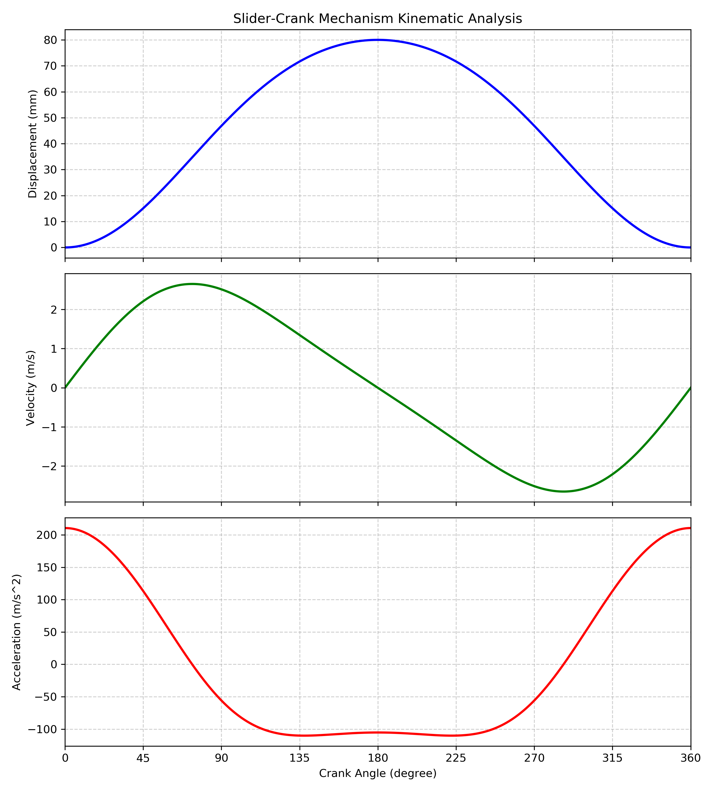
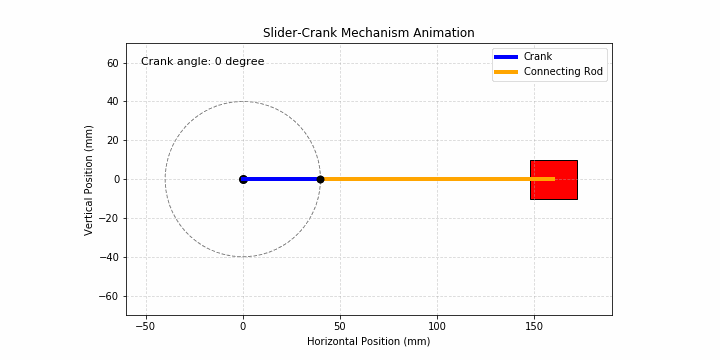
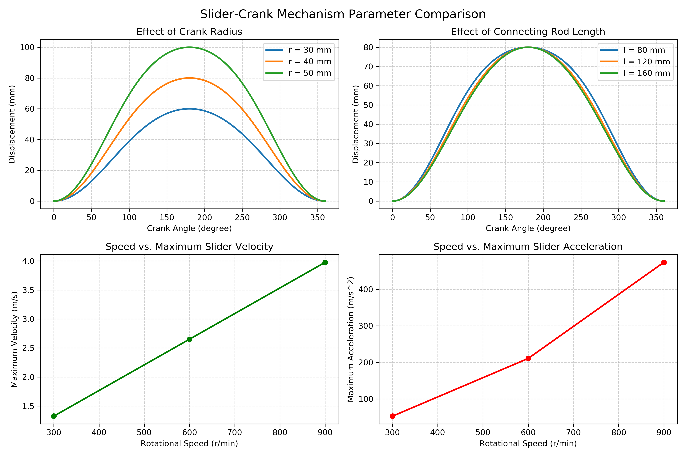

# 基于Python的曲柄滑块机构运动学仿真与参数分析

本项目使用Python建立曲柄滑块机构的几何模型，计算滑块在一个完整运动周期内的位移、速度和加速度，并通过曲线、动画及参数对比展示机构的运动规律。

该项目是面向机械原理与机构运动分析的入门学习项目，重点展示从机械机构简化、数学建模到程序计算和结果分析的完整过程。

## 一、机构简介

曲柄滑块机构主要由曲柄、连杆和滑块组成，可以将曲柄的旋转运动转化为滑块的往复直线运动。

常见应用包括：

- 内燃机活塞机构
- 往复泵
- 空气压缩机
- 机械压力机

## 二、数学模型

设：

- 曲柄半径为 `r`
- 连杆长度为 `l`
- 曲柄转角为 `θ`
- 滑块位置为 `x`

根据机构的几何约束，滑块位置为：

$$
x=r\cos\theta+\sqrt{l^2-r^2\sin^2\theta}
$$

以右止点为位移起点，滑块位移为：

$$
s=r+l-x
$$

曲柄角速度为：

$$
\omega=\frac{2\pi n}{60}
$$

其中，`n`为曲柄转速，单位为r/min。

程序采用数值求导方法，根据位移计算速度和加速度：

$$
v=\frac{ds}{dt}
$$

$$
a=\frac{d^2s}{dt^2}
$$

## 三、主要功能

- 计算滑块位移、速度和加速度
- 绘制一个工作周期内的运动学曲线
- 生成曲柄、连杆和滑块的运动动画
- 分析曲柄半径对滑块行程的影响
- 分析连杆长度对位移曲线的影响
- 分析转速对最大速度和最大加速度的影响
- 将转速参数对比结果导出为CSV文件
- 对不合理的机构尺寸进行输入检查

## 四、项目文件

| 文件 | 说明 |
|---|---|
| `slider_crank.py` | 位移、速度和加速度计算 |
| `slider_crank_animation.py` | 机构运动动画 |
| `parameter_comparison.py` | 参数对比分析 |
| `position_curve.png` | 滑块位移曲线 |
| `kinematic_curves.png` | 位移、速度和加速度曲线 |
| `slider_crank_animation.gif` | 曲柄滑块机构动画 |
| `parameter_comparison.png` | 参数对比结果 |
| `speed_parameter_summary.csv` | 转速对比数据 |

## 五、运行环境

- Python 3.7或更高版本
- NumPy
- Matplotlib
- Pillow

安装所需库：

```bash
pip install numpy matplotlib pillow
```

运行主要运动学分析：

```bash
python slider_crank.py
```

生成机构动画：

```bash
python slider_crank_animation.py
```

运行参数对比分析：

```bash
python parameter_comparison.py
```

也可以直接在Spyder中分别打开并运行上述Python文件。

## 六、计算示例

基础参数设置为：

| 参数 | 数值 |
|---|---:|
| 曲柄半径 | 40 mm |
| 连杆长度 | 120 mm |
| 曲柄转速 | 600 r/min |
| 角速度 | 62.83 rad/s |

计算结果：

| 指标 | 数值 |
|---|---:|
| 滑块行程 | 80.0 mm |
| 最大速度 | 约2.651 m/s |
| 最大加速度 | 约210.550 m/s² |

## 七、运动学结果



## 八、机构运动动画



## 九、参数对比



参数分析得到以下规律：

1. 滑块行程等于曲柄半径的两倍，因此增大曲柄半径会直接增大滑块行程。
2. 改变连杆长度不会改变总行程，但会改变滑块位移曲线的形状和运动特性。
3. 在机构尺寸不变时，提高曲柄转速不会改变滑块位移，但会增大速度和加速度。
4. 最大速度随转速近似成正比变化，最大加速度随转速近似呈平方关系变化。

## 十、模型假设与局限

本项目采用理想平面机构模型，并作出以下简化：

- 曲柄以恒定角速度旋转
- 构件均视为刚体
- 不考虑运动副间隙
- 不考虑摩擦、弹性变形和构件质量
- 仅进行运动学分析，暂不涉及受力和强度计算

因此，本项目适合用于曲柄滑块机构基本运动规律的学习与参数分析，不能直接替代实际机械系统的完整工程设计。

## 十一、项目说明

本项目是在学习机械机构基础知识、查阅相关资料并接受编程指导的基础上完成的入门实践。项目完成了机构模型建立、Python程序调试、运动学结果分析、动画生成和项目文档整理。
